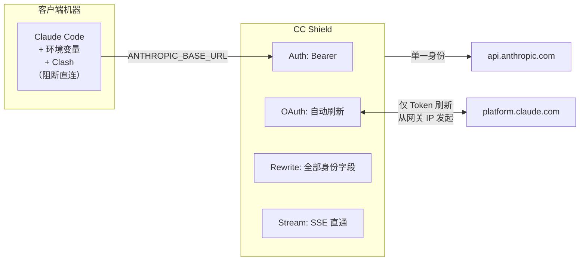

<div align="center">
  <picture>
    <source media="(prefers-color-scheme: dark)" srcset=".github/logo-dark.svg">
    <source media="(prefers-color-scheme: light)" srcset=".github/logo-light.svg">
    
  </picture>

  <p>Claude Code 网关 — Token 认证、指纹归一化、遥测风险管控</p>
</div>

<div align="center">

[![License: MIT][license-shield]][license-url]
[![Version][version-shield]][version-url]
[![Tests][tests-shield]][tests-url]

</div>

<div align="center">
  <a href="#快速开始">快速开始</a> &middot;
  <a href="#客户端配置">客户端配置</a> &middot;
  <a href="#改写范围">改写范围</a> &middot;
  <a href="#clash-规则">Clash 规则</a>
  &nbsp;|&nbsp;
  <a href="README.md">English</a>
</div>

---

# CC Shield

CC Shield 是一个持续维护的分支，专注于通过受控网关运行 Claude Code，提供基于 Token 的客户端认证、规范化机器指纹，以及低噪音的 diff 日志用于升级检测。

基于 [motiful/cc-gateway](https://github.com/motiful/cc-gateway) 原始版本，在 Claude Code 兼容性、伪装策略和运维调试方面做了额外工作。

> **Alpha 阶段** — 项目仍在积极开发中，建议先用非主力账号测试。

> **免责声明** — 本软件仅供安全研究和隐私审计使用。使用者须自行承担遵守相关服务条款的责任，作者不对任何滥用行为负责。

## 背景

Claude Code 通过 3 条并行通道收集 **640+ 种遥测事件**，用 **40+ 个环境维度**对你的机器做指纹识别，并每 5 秒一次向服务端上报。设备 ID、邮箱、操作系统版本、已安装的运行时、Shell 类型、CPU 架构、物理内存——这些信息被持续发送给 Anthropic。

如果你在多台机器上使用 Claude Code，每台设备都会获得一个唯一的永久标识符，且官方没有提供任何管理身份呈现方式的机制。

CC Shield 是一个反向代理，位于 Claude Code 与 Anthropic API 之间。它将设备身份、环境指纹和进程指标归一化为单一的规范档案，让你对离开网络的遥测数据拥有更严格的控制权。

## 功能特性

- **完整身份改写** — 每个 API 请求中的 device ID、邮箱、会话元数据以及 `user_id` JSON blob 均归一化为同一规范身份
- **40+ 环境维度替换** — platform、架构、Node.js 版本、终端、包管理器、运行时、CI 标志、部署环境——整个 `env` 对象被整体替换，而非逐字段打补丁
- **系统提示词净化** — 每个提示词中注入的 `<env>` 块（Platform、Shell、OS Version、工作目录）被改写为规范档案，防止遥测内容与提示词内容被交叉关联检测
- **进程指标归一化** — 物理内存（`constrainedMemory`）、堆大小和 RSS 被替换为规范值，屏蔽硬件差异泄漏
- **集中式 OAuth** — Shield 在内部管理 Token 刷新；客户端机器无需访问 `platform.claude.com`，也无需浏览器登录
- **遥测泄漏防护** — 清除 `baseUrl` 和 `gateway` 字段，防止在分析事件中暴露代理使用情况
- **三层防御架构** — 环境变量（主动路由）+ Clash 规则（网络层封锁）+ 网关改写（身份归一化）

## 快速开始

### 1. 安装与配置

```bash
git clone https://github.com/mkdir700/cc-shield.git
cd cc-shield
npm install

# 生成规范身份
npm run generate-identity
# 生成客户端 Token
npm run generate-token my-machine

# 配置
cp config.example.yaml config.yaml
# 编辑 config.yaml：填入 device_id、客户端 token 和 OAuth refresh_token
```

### 2. 提取 OAuth Token（在已登录 Claude Code 的机器上执行）

```bash
bash scripts/extract-token.sh
# 从 macOS Keychain 复制 refresh_token → 粘贴到 config.yaml
```

### 3. 启动 Shield

```bash
# 开发模式（无 TLS）
npm run dev

# 生产模式
npm run build && npm start

# Docker
docker-compose up -d
```

### 4. 验证

```bash
# 健康检查
curl http://localhost:8443/_health

# 改写验证（显示改写前后的 diff）
curl -H "Authorization: <your-token>" http://localhost:8443/_verify
```

## 客户端配置

在每台客户端机器上添加以下环境变量，无需浏览器登录。

```bash
# 将所有 Claude Code 流量路由到 Shield
export ANTHROPIC_BASE_URL="https://gateway.your-domain.com:8443"

# 禁用旁路遥测（Datadog、GrowthBook、版本检查）
export CLAUDE_CODE_DISABLE_NONESSENTIAL_TRAFFIC=1

# 使用 Claude Code 原生网关认证路径向 Shield 认证
export ANTHROPIC_AUTH_TOKEN="YOUR_TOKEN"
```

CC Shield 接受以下任意 Header 中的客户端 Token，并在转发上游前将其剥离：

- `Authorization: YOUR_TOKEN` 或 `Authorization: Bearer YOUR_TOKEN`
- `Proxy-Authorization: YOUR_TOKEN` 或 `Proxy-Authorization: Bearer YOUR_TOKEN`
- `X-Api-Key: YOUR_TOKEN`

因此兼容以下方式：

- `ANTHROPIC_AUTH_TOKEN`
- `ANTHROPIC_API_KEY`
- 基于 `apiKeyHelper` 的网关配置（发出 `Authorization` / `X-Api-Key`）

或运行交互式配置脚本：

```bash
bash scripts/client-setup.sh
```

也可以使用 **[cc-switch](https://github.com/farion1231/cc-switch)** — 一个桌面端 GUI 工具，可以通过图形界面管理 Claude Code 的 provider 配置。将 CC Shield 添加为自定义 provider 后，一键切换，无需手动修改环境变量。

然后正常启动 Claude Code 即可。如果你之前遇到 `/login` 返回 `401 OAuth authentication is currently not supported`，请移除旧的 `CLAUDE_CODE_OAUTH_TOKEN` 方案，改用上述基于 Token 的网关认证方式。

## 改写范围

| 层级 | 字段 | 操作 |
|------|------|------|
| **身份** | metadata + events 中的 `device_id` | → 规范 ID |
| | `email` | → 规范邮箱 |
| **环境** | `env` 对象（40+ 字段） | → 整体替换 |
| **进程** | `constrainedMemory`（物理内存） | → 规范值 |
| | `rss`、`heapTotal`、`heapUsed` | → 在合理范围内随机化 |
| **请求头** | `User-Agent` | → 规范 CC 版本 |
| | `Authorization` / `Proxy-Authorization` / `X-Api-Key` | → 剥除客户端凭证，替换为网关管理的 OAuth Token |
| | `x-anthropic-billing-header` | → 规范指纹 |
| **提示词文本** | `Platform`、`Shell`、`OS Version` | → 规范值 |
| | `Working directory` | → 规范路径 |
| | `/Users/xxx/`、`/home/xxx/` | → 规范 home 前缀 |
| **泄漏字段** | `baseUrl`（ANTHROPIC_BASE_URL） | → 剔除 |
| | `gateway`（提供商检测） | → 剔除 |

## Clash 规则

Clash 作为网络层安全兜底。即使 Claude Code 绕过环境变量，或在未来版本中新增硬编码的端点，Clash 也能阻断直连。

```yaml
rules:
  - DOMAIN,gateway.your-domain.com,DIRECT    # 允许访问网关
  - DOMAIN-SUFFIX,anthropic.com,REJECT        # 阻断直连 API
  - DOMAIN-SUFFIX,claude.com,REJECT           # 阻断 OAuth
  - DOMAIN-SUFFIX,claude.ai,REJECT            # 阻断 OAuth
  - DOMAIN-SUFFIX,datadoghq.com,REJECT        # 阻断遥测
```

完整模板见 [`clash-rules.yaml`](clash-rules.yaml)。

## 架构



**纵深防御：**

| 层级 | 机制 | 防御效果 |
|------|------|----------|
| 环境变量 | `ANTHROPIC_BASE_URL` + `DISABLE_NONESSENTIAL` + `ANTHROPIC_AUTH_TOKEN` | CC 主动路由到 Shield，禁用旁路通道，使用 Token 认证 |
| Clash | 基于域名的 REJECT 规则 | 阻断任何意外或未来的直连请求 |
| 网关 | Body + Header + 提示词改写 | 40+ 指纹维度全部归一化为单一设备档案 |

## 注意事项

- **MCP 服务器** — `mcp-proxy.anthropic.com` 是硬编码的，不遵循 `ANTHROPIC_BASE_URL`。如果客户端使用官方 MCP 服务器，这些请求会绕过网关。如不需要 MCP，建议用 Clash 封锁此域名。
- **CC 升级** — 新版 Claude Code 可能引入新的遥测字段或端点。升级后请监控 Clash 的 REJECT 日志，排查异常连接尝试。
- **Token 生命周期** — 网关会自动刷新 OAuth access token。如果底层 refresh token 过期（概率较低），在管理机器上重新运行 `extract-token.sh` 即可。

## 参考资料

本项目基于以下工作：

- [Claude Code 封号机制深度探查报告](https://bytedance.larkoffice.com/docx/E2JudVzf7oCNfhxyxaQcZIW1n0g) — 对 Claude Code 640+ 遥测事件、40+ 指纹维度及封号检测机制的逆向工程分析
- [instructkr/claude-code](https://github.com/instructkr/claude-code) — 用于遥测审计的 Claude Code 反混淆源码

## License

[MIT](LICENSE)

---

<div align="center">
  <sub>Crafted with <a href="https://github.com/anthropics/claude-code">Claude Code</a></sub>
</div>

<!-- Badge references -->
[license-shield]: https://img.shields.io/github/license/mkdir700/cc-shield
[license-url]: https://github.com/mkdir700/cc-shield/blob/main/LICENSE
[version-shield]: https://img.shields.io/badge/version-0.1.0--alpha-blue
[version-url]: https://github.com/mkdir700/cc-shield/releases
[tests-shield]: https://img.shields.io/badge/tests-16%20passed-brightgreen
[tests-url]: https://github.com/mkdir700/cc-shield/blob/main/tests/rewriter.test.ts
